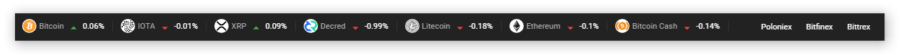

### CryptoBar is a way to check variations on your cryptocurrencies and tokens on a discreet bar.


## Getting Started

To get started you can:

Download [here](https://github.com/isaccanedo/CryptoBar) the latest release

or

Clone this repository locally:

``` bash
git clone https://github.com/isaccanedo/CryptoBar
```

Install dependencies with npm:

``` bash
npm install
```

And finally:

```
npm start  
```
